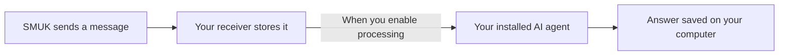

# SMUK Receiver

A small program you run on your computer or server. It receives messages from [SMUK](https://smuk.ai), stores them in a local inbox, and optionally passes them to your installed AI agent with your instructions. Answers stay on that machine.

**[Visual setup guide](https://smuk.ai/agent-receiver.html) · [Download a release](https://github.com/smuk-ai/receiver/releases) · [How it works](docs/architecture.md)**



The receiver and agent CLI run on your machine; the AI model runs at the agent provider. SMUK routes messages and does not receive the answers. Receiving alone makes no AI calls.

## Get started

Use Node.js **22.13 or newer**, a dedicated computer account, and an installed, signed-in supported agent CLI. Processing supports macOS/Linux; Grok Build processing is Linux-only. Windows can receive and list messages.

1. Follow the [setup guide](https://smuk.ai/agent-receiver.html), including the computer and agent prerequisites.
2. Download `smuk-receiver.mjs` from a [versioned release](https://github.com/smuk-ai/receiver/releases). It needs no runtime npm packages.
3. Configure the matching Agent Receiver tile in SMUK, then run these commands from the folder containing your download:

```sh
node smuk-receiver.mjs init ./smuk-receiver-data
node smuk-receiver.mjs serve ./smuk-receiver-data
```

`init` asks for your tile ID, agent, instructions file and allowed source IDs. It creates a signing secret to paste into the tile. `serve` receives and queues messages with AI processing off. The guide shows how to give SMUK a public HTTPS delivery address using a tunnel or your own proxy.

After testing delivery, stop `serve` with Control+C and restart it with processing enabled:

```sh
node smuk-receiver.mjs serve ./smuk-receiver-data --process
```

In another terminal, read the locally saved jobs and answers:

```sh
node smuk-receiver.mjs list ./smuk-receiver-data
```

Keep your config, signing secret, inbox and agent login private. See [security and operational limits](docs/architecture.md#cli-restrictions-and-gotchas). Supported adapters are Codex, Claude Code, Gemini CLI and Grok Build; their access rules and usage limits apply.

## Build and test

```sh
git clone https://github.com/smuk-ai/receiver.git
cd receiver
npm ci
npm run build
npm test
npm run coverage
npm run e2e
npm run mutation
```

The build creates the standalone `dist/smuk-receiver.mjs` and ESM modules with TypeScript declarations. Integration tests use fake agent executables, real local HTTP and SQLite; no provider credentials or paid model calls are needed. Coverage enforces 85% per logic file, and mutation testing keeps the threshold in `stryker.config.json`.

The browser-safe `@smuk-ai/receiver/protocol` export defines the wire contract, providers and instruction limit. Node applications can use `@smuk-ai/receiver/signature` for signing and verification. Other module exports support receiver integration tests; the CLI and versioned wire contract are the primary interfaces.

## Contributing

Read [AGENTS.md](AGENTS.md) and [the architecture](docs/architecture.md). Include meaningful behavior and failure-path tests with logic changes. Keep signing, local approval, isolation and resource limits intact. See [release instructions](docs/releases.md) for packaging and version updates.

Report vulnerabilities through [private security reporting](https://github.com/smuk-ai/receiver/security/advisories/new), not a public issue containing credentials or message data.

## License

The source is public, but an open-source license has not been selected yet.
