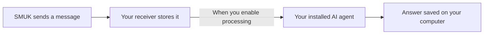

# SMUK Receiver

A small program you run on your computer or server. It receives messages from [SMUK](https://smuk.ai), stores them in a local inbox, and optionally passes them to your installed AI agent with your instructions. Answers stay on that machine.

**[Visual setup guide](https://smuk.ai/agent-receiver.html) · [Download a release](https://github.com/smuk-ai/receiver/releases) · [How it works](docs/architecture.md)**



The receiver and agent CLI run on your machine; the AI model runs at the agent provider. SMUK routes messages and does not receive the answers. Receiving alone makes no AI calls.

## Get started

In SMUK, add an **Agent Receiver** tile, connect a source, and enter your agent and instructions. Choose **Connect computer** and copy its setup command into Terminal on your computer.

The command installs the receiver and connection helper privately in `~/.smuk`. The receiver shows the exact instructions and source tiles for your approval, connects the tile, and starts receiving in that same terminal. Return to SMUK and **Publish** your blueprint. Receiving makes no AI calls.

Keep that terminal open. Its commands are:

| Command | What it does |
| --- | --- |
| `process` | Enables AI processing using your installed, signed-in agent CLI. |
| `pause` | Stops new AI jobs; the current job may finish and messages still arrive. |
| `results` | Shows locally saved job states and answers. |
| `quit` | Stops the receiver and its temporary public connection. |

Quick setup uses a temporary Cloudflare connection intended for trying the receiver. To reconnect after stopping, use **Connect computer** on the same tile again. Your inbox, signing key and local restrictions are retained; review the instructions locally again and publish the new delivery address. AI processing always starts off.

For processing, use a dedicated computer account with your agent installed and signed in. macOS/Linux support processing; Grok Build processing is Linux-only. Windows can use the manual receive/list workflow. Your agent provider's access rules and usage limits apply. Keep your config, signing secret, inbox and agent login private.

<details>
<summary>Manual setup and a stable public address</summary>

Use Node.js **22.13 or newer** and download `smuk-receiver.mjs` from a [versioned release](https://github.com/smuk-ai/receiver/releases). It needs no runtime npm packages.

```sh
node smuk-receiver.mjs init ./smuk-receiver-data
node smuk-receiver.mjs serve ./smuk-receiver-data
```

`init` asks for your tile ID, agent, instructions file and allowed source IDs. It creates a signing secret to paste into the tile. `serve` receives and queues messages with AI processing off. The [setup guide](https://smuk.ai/agent-receiver.html) shows how to supply a stable public HTTPS address using your own tunnel or reverse proxy.

After testing delivery, stop `serve` with Control+C and restart with processing enabled:

```sh
node smuk-receiver.mjs serve ./smuk-receiver-data --process
```

In another terminal, read local jobs and answers:

```sh
node smuk-receiver.mjs list ./smuk-receiver-data
```

</details>

See [security and operational limits](docs/architecture.md#cli-restrictions-and-gotchas). Supported adapters are Codex, Claude Code, Gemini CLI and Grok Build. The receiver does not attach to an existing chat or return answers to SMUK.

## Build and test

```sh
git clone https://github.com/smuk-ai/receiver.git
cd receiver
npm ci
npm run build
npm test
npm run coverage
npm run e2e
npm run test:package
npm run mutation
```

The build creates the standalone `dist/smuk-receiver.mjs` and ESM modules with TypeScript declarations. Integration tests use fake agent executables, real local HTTP and SQLite; no provider credentials or paid model calls are needed. Coverage enforces 85% per logic file, and mutation testing keeps the threshold in `stryker.config.json`.

The browser-safe `@smuk-ai/receiver/protocol` export defines the wire contract, providers and instruction limit. Node applications can use `@smuk-ai/receiver/signature` for signing and verification. Other module exports support receiver integration tests; the CLI and versioned wire contract are the primary interfaces.

## Contributing

Read [AGENTS.md](AGENTS.md) and [the architecture](docs/architecture.md). Include meaningful behavior and failure-path tests with logic changes. Keep signing, local approval, isolation and resource limits intact. See [release instructions](docs/releases.md) for packaging and version updates.

Report vulnerabilities through [private security reporting](https://github.com/smuk-ai/receiver/security/advisories/new), not a public issue containing credentials or message data.

## License

Licensed under [Apache License 2.0](LICENSE). See [NOTICE](NOTICE) for attribution. The standalone download includes the complete license and notice; they are also included in the package and release assets. This license applies to the receiver repository, not the separate SMUK application or AI providers.
